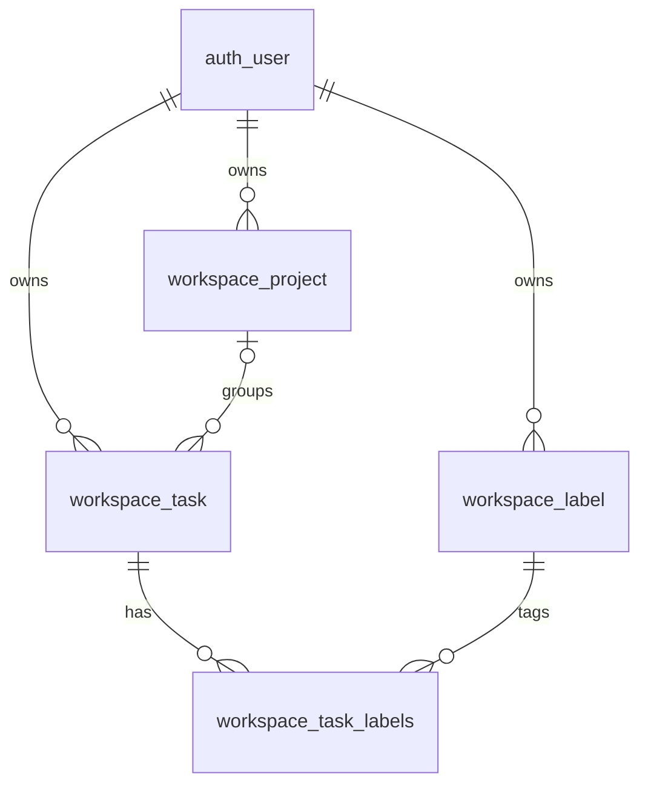

# Database specification

Source baseline: 2026-09-30. This specification is derived from `config/settings.py`, `workspace/models.py`, workspace migrations and `seed_demo.py`. It describes the schema produced by migrations, not a snapshot of an inspected running database. See [functional specification](FUNCTIONAL_SPECIFICATION.md) and [API specification](API.md) for application contracts.

## 1. Storage and conventions

| Setting | Value |
| --- | --- |
| Engine | `django.db.backends.sqlite3` |
| File | `BASE_DIR / db.sqlite3` (repository root) |
| Business application | `workspace` |
| User model | Django built-in `auth.User` (`auth_user`) |
| Workspace primary keys | Django `BigAutoField`; generated integer IDs |
| Time handling | `USE_TZ=True`, application time zone `Asia/Tbilisi`; Django stores normalized datetime values and applies time zones when rendering |
| Schema management | Django migrations via `python manage.py migrate` |

Tables below describe Django model types. SQLite's type affinity is not equivalent to strict enforcement of every declared length or value choice. `blank=True` permits empty form input; `null=True` permits SQL NULL. Empty task/project descriptions are stored as empty strings. Due date and project can be NULL. Model defaults are Python/ORM defaults, not guarantees of permanent SQL `DEFAULT` clauses for raw inserts.

## 2. Relationships



A task has exactly one owner, zero or one project and zero or more labels. A project/label has exactly one owner. The same label can belong to many tasks across multiple projects, including unassigned tasks. Public workspace forms ensure related entities belong to the same user; the schema has no composite constraint enforcing that ownership equality.

## 3. Business tables

### `workspace_task`

| Column | Django type | SQL NULL | Default / rule |
| --- | --- | --- | --- |
| `id` | BigAutoField | No | Generated primary key. |
| `owner_id` | ForeignKey → `auth_user.id` | No | Indexed; reverse accessor `user.tasks`; ORM CASCADE on user deletion. |
| `project_id` | ForeignKey → `workspace_project.id` | Yes | Optional; indexed; reverse accessor `project.tasks`; ORM SET_NULL on project deletion. |
| `title` | CharField(120) | No | Form/model validation: 3–120 characters. Not unique. |
| `description` | TextField(max_length=2000, blank=True) | No | Optional form field; empty string when absent. |
| `status` | CharField(20) | No | ORM default `todo`; choices `todo`, `in_progress`, `done`. |
| `priority` | CharField(10) | No | ORM default `medium`; choices `low`, `medium`, `high`. |
| `due_date` | DateField(blank=True) | Yes | Optional date, past dates allowed. |
| `created_at` | DateTimeField(auto_now_add=True) | No | Set on creation by ORM. No modification timestamp. |

Default ORM ordering: `created_at DESC, id DESC`. `labels` is a relation through `workspace_task_labels`, not a physical column in this table. Status/priority choices and text validators are not custom database CHECK constraints.

### `workspace_project`

| Column | Django type | SQL NULL | Default / rule |
| --- | --- | --- | --- |
| `id` | BigAutoField | No | Generated primary key. |
| `owner_id` | ForeignKey → `auth_user.id` | No | Indexed; reverse accessor `user.projects`; ORM CASCADE. |
| `name` | CharField(80) | No | Form/model validation: 2–80 characters. |
| `description` | TextField(max_length=500, blank=True) | No | Optional form field, empty string when absent. |
| `created_at` | DateTimeField(auto_now_add=True) | No | Set on creation. |

Constraint `unique_project_name_per_owner`: UNIQUE (`owner_id`, `name`). Default ORM ordering: `name ASC, id ASC`. The schema does not specify a case-insensitive collation or case-normalized unique key.

### `workspace_label`

| Column | Django type | SQL NULL | Default / rule |
| --- | --- | --- | --- |
| `id` | BigAutoField | No | Generated primary key. |
| `owner_id` | ForeignKey → `auth_user.id` | No | Indexed; reverse accessor `user.labels`; ORM CASCADE. |
| `name` | CharField(40) | No | Form/model validation: 2–40 characters. |
| `color` | CharField(10) | No | ORM default `blue`; choices `blue`, `green`, `amber`, `red`, `purple`. |
| `created_at` | DateTimeField(auto_now_add=True) | No | Set on creation. |

Constraint `unique_label_name_per_owner`: UNIQUE (`owner_id`, `name`). Default ORM ordering: `name ASC, id ASC`.

### `workspace_task_labels`

Django automatically creates this join table for `Task.labels`.

| Column | Type / relation | SQL NULL | Rule |
| --- | --- | --- | --- |
| `id` | Generated integer primary key | No | Internal association ID; not exposed by the API. |
| `task_id` | Foreign key → `workspace_task.id` | No | Indexed. |
| `label_id` | Foreign key → `workspace_label.id` | No | Indexed. |

The pair (`task_id`, `label_id`) is unique. A repeated label ID cannot produce duplicate associations. Reverse accessor: `label.tasks`. There is no independent owner, timestamp, rank or label-specific task state on the association.

## 4. Django-managed tables

These are created by installed Django applications. Their exact physical schema and generated index names are managed by Django 5.2.17 migrations, not custom workspace migrations.

| Table | Columns / role |
| --- | --- |
| `auth_user` | `id`, `password`, nullable `last_login`, `is_superuser`, unique `username` (150), `first_name` (150), `last_name` (150), `email` (254), `is_staff`, `is_active`, `date_joined`. Password contains a hash, not plaintext. Email is not unique. |
| `auth_group` | `id`, unique `name`; permission grouping. |
| `auth_permission` | `id`, `name`, `content_type_id`, `codename`; unique (`content_type_id`, `codename`). |
| `auth_user_groups` | `id`, `user_id`, `group_id`; unique user/group pair. |
| `auth_user_user_permissions` | `id`, `user_id`, `permission_id`; unique user/permission pair. |
| `auth_group_permissions` | `id`, `group_id`, `permission_id`; unique group/permission pair. |
| `django_content_type` | `id`, `app_label`, `model`; unique app/model pair. |
| `django_session` | `session_key` primary key, `session_data`, indexed `expire_date`; server-side session persistence. |
| `django_admin_log` | `id`, `action_time`, `user_id`, nullable `content_type_id`, nullable `object_id`, `object_repr`, `action_flag`, `change_message`; admin operations, not a general workspace audit log. |
| `django_migrations` | `id`, `app`, `name`, `applied`; applied migration history. |

SQLite may also maintain internal tables such as `sqlite_sequence`. Registration only collects username, email and passwords; it does not expose first/last name or staff flags. Terms acceptance has no database column. Session data is framework-encoded; applications should use Django session APIs rather than treating it as plain JSON. CSRF tokens are not stored in a dedicated workspace table.

## 5. Constraints, validation and deletion

| Rule | Enforcement |
| --- | --- |
| Unique primary keys and required/nullable columns | Database schema. |
| Foreign key existence | Database foreign keys when enforcement is enabled, as on Django-managed SQLite connections. |
| Unique owned project/label names | Named database constraints plus duplicate-name form checks. |
| Unique task/label association | Database uniqueness on the join table. |
| Minimum/maximum text length, valid choices, accepted terms | Forms/model validation; SQLite raw writes can bypass these rules. `Model.save()` does not automatically call `full_clean()`. |
| Task/project/label owner equality | Owner-scoped workspace form querysets; not a database invariant. |
| Resource privacy | Owner-filtered views/API; the database does not implement row-level access control. |

| Deleted object through Django ORM | Result |
| --- | --- |
| Task | Task and its join-table associations removed; projects/labels retained. |
| Project | Project removed; referencing tasks retained with NULL `project_id`; task-label associations retained. |
| Label | Label and its join-table associations removed; tasks/projects retained. |
| User | Owned tasks/projects/labels and their dependent associations removed through ORM cascades. |

`on_delete=CASCADE` and `SET_NULL` describe Django's deletion collector behavior. Do not assume raw SQLite DELETE statements perform equivalent SQL cascading or nullification: raw deletion can fail a foreign-key constraint instead. Use ORM/API deletion when testing application semantics. Independent SQLite clients must check `PRAGMA foreign_keys` for their own connection.

No additional application-defined indexes exist beyond primary keys, foreign-key indexes and uniqueness constraints. Default ordering is applied by ORM queries, not guaranteed for raw SQL without ORDER BY. Counts in API responses are computed aggregates, not stored columns.

## 6. Migration history

| Workspace migration | Effect |
| --- | --- |
| `0001_initial` | Creates Task with owner, title, description, status, priority, optional due date and creation time. |
| `0002_alter_task_description_alter_task_due_date_and_more` | Changes field/display labels and choice labels to English; retains stored status/priority codes. |
| `0003_alter_task_owner_label_task_labels_project_and_more` | Adds the owner reverse accessor, Label, Project, task-label many-to-many relation, optional task project and per-owner name uniqueness constraints. |

Apply all migrations before starting the application or seeding. Workspace migrations depend on the configured user model. There is no migration that automatically seeds demo data; the management command is separate.

Useful read-only inspection commands after migration:

```powershell
python manage.py showmigrations
python manage.py sqlmigrate workspace 0003
```

Inside a SQLite client connected to the intended database:

```sql
PRAGMA table_info('workspace_task');
PRAGMA foreign_key_list('workspace_task');
PRAGMA index_list('workspace_task');
PRAGMA index_list('workspace_project');
PRAGMA index_list('workspace_label');
PRAGMA index_list('workspace_task_labels');
PRAGMA foreign_key_check;
```

## 7. Demo fixture specification

Run `python manage.py seed_demo --reset` only when intentionally resetting demo-owned data. It recreates 12 tasks, 3 projects, 5 labels and 24 task-label associations for username `demo`. Password becomes `DemoPass123!`; email is `demo@example.com` on initial user creation and is not reset on an existing account. Other users' data remains untouched. IDs and creation timestamps are generated and should not be hardcoded in tests.

Project keys below: **Web** = Web application; **API** = Public API; **Release** = Release 1.0. Label colors: API blue, UI purple, Regression green, Critical red, Data amber. Sequence is the seed creation order, not the default task-list order.

| # | Title | Status | Priority | Due date | Project | Labels |
| --- | --- | --- | --- | --- | --- | --- |
| 1 | Gather requirements | todo | low | NULL | NULL | API, Regression |
| 2 | Prepare test data | in_progress | low | 2026-09-16 | API | UI, Critical |
| 3 | Check registration form | done | low | 2026-09-17 | Release | Regression, Data |
| 4 | Set up the environment | todo | medium | 2026-09-18 | Web | Critical, API |
| 5 | Check task search | in_progress | medium | NULL | API | Data, UI |
| 6 | Update project description | done | medium | 2026-09-20 | NULL | API, Regression |
| 7 | Run the deletion scenario | todo | high | 2026-09-21 | Web | UI, Critical |
| 8 | Check the mobile layout | in_progress | high | 2026-09-22 | API | Regression, Data |
| 9 | Explore boundary values | done | high | NULL | Release | Critical, API |
| 10 | Check filters | todo | low | 2026-09-24 | Web | Data, UI |
| 11 | Plan the week | in_progress | low | 2026-09-25 | NULL | API, Regression |
| 12 | Finish the first stage | done | low | 2026-09-26 | Release | UI, Critical |

Each description is `Training task N. Add notes and verify that changes are saved.` for its 1-based sequence number. Label table/list ordering is by name, not the order shown in each fixture row.

Expected totals: 12 tasks, 8 active, 4 done, 3 unassigned; 4 tasks per status; 6 low/3 medium/3 high priorities. Each project has 3 tasks and 4 distinct labels; Release has 3 completed tasks, the other projects have none. Label totals: API 5, UI 5, Regression 5, Critical 5, Data 4. The report has 15 matrix cells.

Without `--reset`, the command retains existing demo tasks and existing project/label attributes, creates missing named projects/labels, and creates the twelve tasks only when no demo tasks exist. It then overwrites project and label assignments on every existing demo task in primary-key order. It only resets the password when creating the user or when `--reset` is supplied. The entire seed command runs in a transaction.

## 8. Database acceptance checks

- A task can exist without a project or labels; it cannot exist without an owner.
- Multiple tasks may share a title, project or label.
- A user cannot have two identical project names or two identical label names; separate users may reuse names.
- Reassigning a task changes its project foreign key; replacing labels updates the join table without changing task identity.
- Deleting a project through the API preserves task count and increases the unassigned count by the number of affected tasks.
- Deleting a label through the API preserves task count and removes every association to that label.
- Aggregate task counts use distinct tasks when joining labels; a two-label task must not count twice.
- All relations created through workspace forms/API have matching owners. The following integrity queries should return zero rows for such data.

```sql
SELECT t.id, t.owner_id, p.owner_id AS project_owner_id
FROM workspace_task AS t
JOIN workspace_project AS p ON p.id = t.project_id
WHERE t.owner_id <> p.owner_id;

SELECT t.id, t.owner_id, l.id AS label_id, l.owner_id AS label_owner_id
FROM workspace_task AS t
JOIN workspace_task_labels AS tl ON tl.task_id = t.id
JOIN workspace_label AS l ON l.id = tl.label_id
WHERE t.owner_id <> l.owner_id;
```

For task/project joins, distinct aggregates and complete project-label matrices, use [JOIN examples](JOIN_EXAMPLES.md). Run assertions against IDs obtained by username/name or API responses rather than assumed fixture primary keys.
